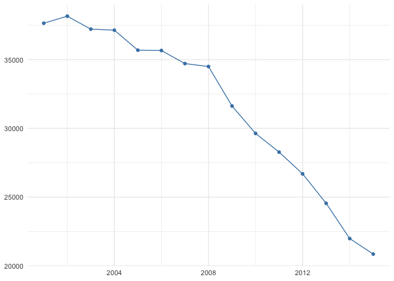
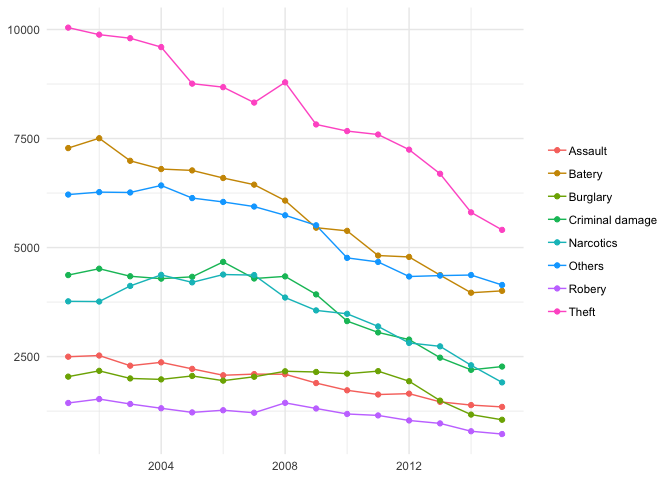
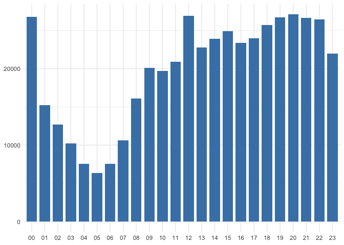
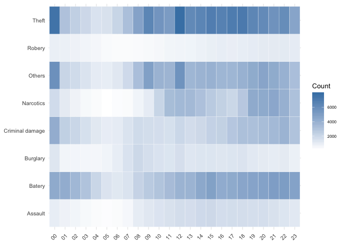
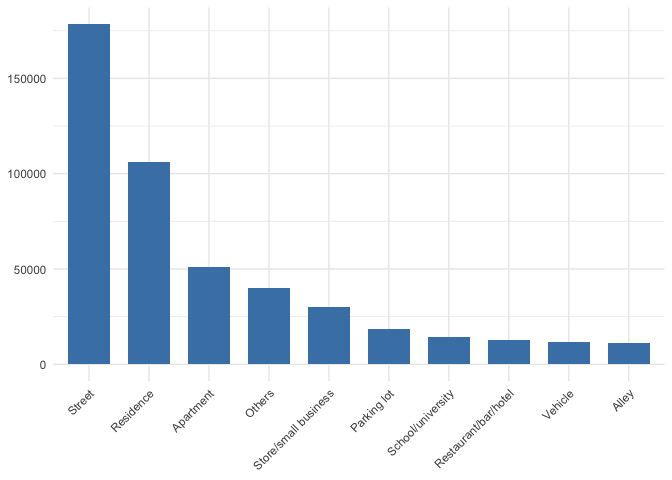
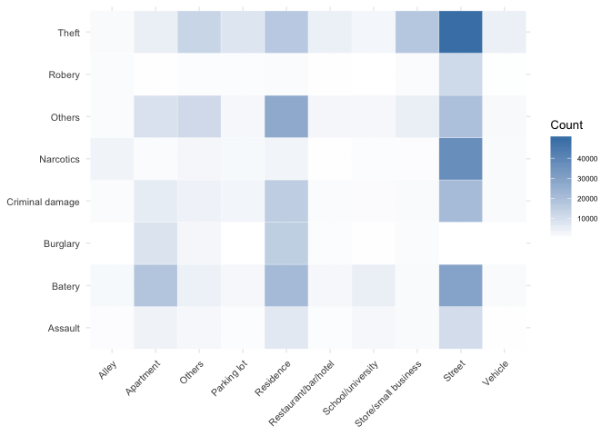
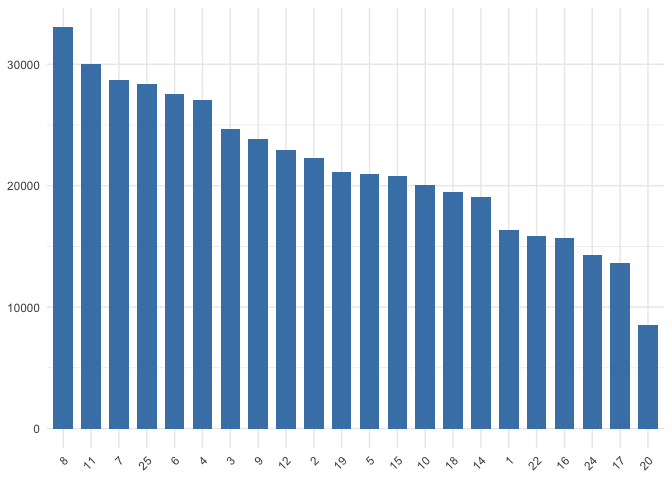
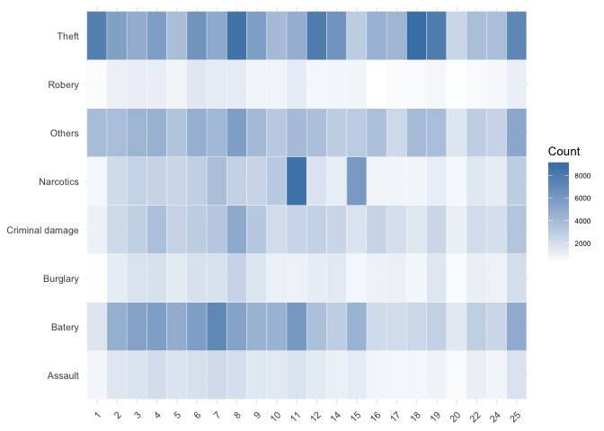

Crime in Chicago: A Data Analysis Summary using R
================
Eugeni Vidal
13 December, 2018

Introduction
============

This report is the first assessment of the **MATH5741M Statistical Theory and Methods** module. Its aims are to summarise a crime dataset from the city of Chicago and answer the following research questions:

-   How has crime evolved over time in the city of Chicago?

-   What time of day do most crime occur?

-   In which locations of the city is crime more likely to happen?

-   Which districts are more potentially dangerous?

Data and methods
================

The analysis is done with a sample of the [crime dataset from the Chicago Police Department](https://data.cityofchicago.org/Public-Safety/Crimes-2001-to-present/ijzp-q8t2) which contains all the crime incidents that occurred in the city of Chicago from 2001 to the present.

We first prepare the data, creating, transforming and cleaning the variables we are interested in. Then, we perform the statistical analysis through line graphs, bar graphs and heat-maps which will answer each of our research questions.

The report has been done with `Rmarkdown` and it is code reproducible. However, due to space limitation (it should not be more than 6 pages in total) does not include all the code written for its performance. <sup></sup>[1]

Results
=======

Data preparation
----------------

First, we activate the libraries we will need to set up the project.

``` r
# Activate libraries
library(ggplot2)
library(lubridate)
library(zoo)
library(dplyr)
library(knitr)
```

Second, we load the data into the `R` environment.

``` r
# Read csv in R
dd=read.csv("http://www1.maths.leeds.ac.uk/~charles/math5741/crime.csv",header=T)
```

Third, we create two new variables `Count` and `Hour` and make some necessary transformations in date variables in order to make `R` understand them.

``` r
# Create a variable count with value 1
dd$Count <- 1
# Convert Date from factor to date
dd$Date <- mdy_hms(dd$Date)
# Extract hour from Date
dd$Hour <- substring(dd$Date, 12,13)
# Drop time from Date
dd$Date <- as.Date(dd$Date, format="%m/%d/%Y")
```

Fourth, we group in larger categories the existent ones in the variables `Primary.Type` and `Location.Description`, and call them `Type_grouped` and `Location_grouped` respectively<sup></sup>[2].

The next step is to drop all those columns we do not need to answer our research questions.

``` r
# Drop all variables we are not interested in
dd <- dd[, -c(1:2, 4:11, 13:15, 17:18)]
```

Then, we clean the dataset of missing values and remove all values from 2016 - this last year is not complete.

``` r
# Remove NAs
dd <- dd[complete.cases(dd),]
# Remove 2016 rows
dd <- dd[!dd$Year > 2015,]
```

Finally, we show the the dataset ready for exploration.

``` r
# Show first 5 records
head(dd)
```

    ##         Date District Year Count Hour Type_grouped Location_grouped
    ## 1 2013-07-20       19 2013     1   00       Batery           Street
    ## 2 2013-07-20       19 2013     1   01       Others           Street
    ## 3 2013-07-19        2 2013     1   21      Assault        Apartment
    ## 4 2013-07-20        9 2013     1   02    Narcotics           Street
    ## 5 2013-07-12        3 2013     1   17        Theft           Street
    ## 6 2013-07-20        9 2013     1   01       Batery        Apartment

Data exploration
----------------

### How has crime evolved over time in the city of Chicago?

To answer the first question we plot the number of crimes per year from 2001 to 2015 (Figure 1) <sup></sup>[3]. The graph shows that crime in the city of Chicago has been decreasing year after year, with a continuous decline.


<p class="caption">
Crimes evolution 2001-2015
</p>

Figure 2 depicts the annual frequency of crimes per type and their trend. The most common types of crime are Theft and Batery. All types have been falling to a greater or lesser extent.


<p class="caption">
Crimes evolution per type of crime 2001-2015
</p>

### What time of day do most crime occur?

The following bar graph (Figure 3) shows the number of crimes increases gradually from 05:00 in the morning (the hour with less crimes) until 20:00 in the evening (the hour with the most crimes). The hours of 12:00 and 00:00 are exceptionally high, at a similar level as 20:00.


<p class="caption">
Crimes per hour
</p>

The heat-map in Figure 4 shows the distribution of number of crimes per hour and type. For example, we can see that the peak hours of Theft and Others are at 00:00, 09:00 and 12:00. Narcotics concentrate between 10:00 to 14:00 and 19:00 to 22:00. Other types are more evenly distributed throughout the day.


<p class="caption">
Type of crime vs hour
</p>

### In which locations of the city is crime more likely to happen?

As is illustrated by Figure 5, most crimes happen in the street, followed by Residences and Apartments.


<p class="caption">
Crimes per location
</p>

If we visualise the distribution of crimes per location and type (Figure 6), we can see that some types occur in specific locations. For instance, Robery is recorded almost enterily in the Street, as well as Narcotics. However, Burglary and Others are registered particularly in Reseidences or Apartments. What makes sense.


<p class="caption">
Type of crime vs location
</p>

### Which districts are more potentially dangerous?

Finally, in Figure 7, we visualise the number of crimes per districts. The most dangerous district seems number 8, with more than 30,000 records in the 15 years, while district 20 with less than 10,000 seems the safest.



Figure 8 ilustrates some interesting findings in the relations between the type of crime and districts where they occurred. For example, we can see that districts 1, 8, 12 and 18 are particularly dangerous in terms of Theft, that districts 7 and 11 stand out in terms of Batery, but above all that Narcotics crime concentrates in district 11 and 15.


<p class="caption">
Type of crime vs district
</p>

[1] To see the whole code visit <https://github.com/eugenividal/Chicago-Crime-Data-Analysis>.

[2] The code written to group the variables' categories can be seen at <https://github.com/eugenividal/Chicago-Crime-Data-Analysis>

[3] See visualisations code at <https://github.com/eugenividal/Chicago-Crime-Data-Analysis>
